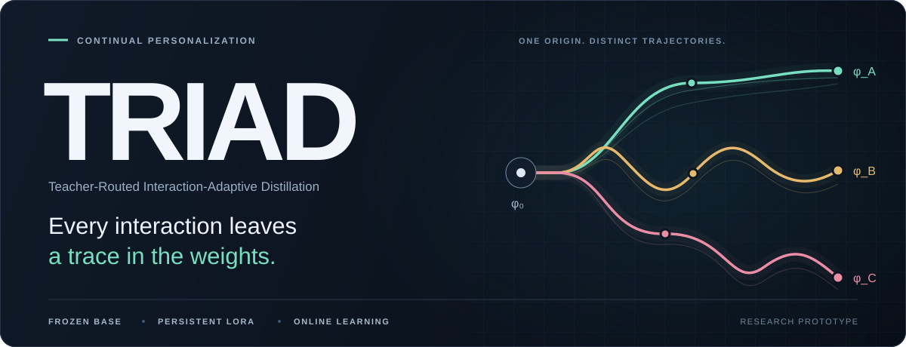
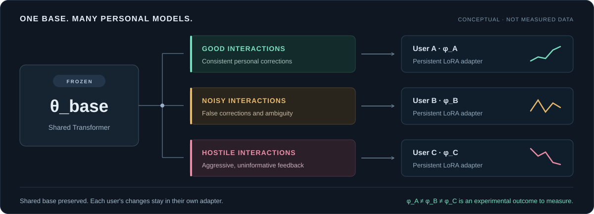
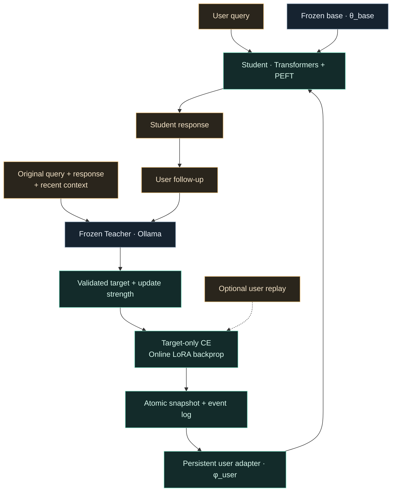

<p align="center">
  
</p>

<p align="center">
  <strong>대화가 쌓이면, 사용자별 모델의 가중치가 달라집니다.</strong><br>
  Teacher-Routed Interaction-Adaptive Distillation
</p>

<p align="center">
  <a href="#quick-start">시작하기</a> ·
  <a href="#research-design">연구 철학</a> ·
  <a href="#architecture">구조</a> ·
  <a href="#experiments">실험</a> ·
  <a href="#reference">문서</a>
</p>

<p align="center">
  <code>Python 3.11+</code> &nbsp;
  <code>PyTorch</code> &nbsp;
  <code>Transformers + PEFT</code> &nbsp;
  <code>Ollama</code>
</p>

---

TRIAD는 상호작용을 **지속적인 사용자별 LoRA 업데이트**로 누적하는 continual personalization 연구 프로토타입입니다. Frozen Teacher가 경험을 학습 target으로 해석하고, Student는 그 target으로 실제 역전파를 수행합니다. 각 사용자의 AI는 서로 다른 방향으로 성장하거나 망가질 수 있습니다.

| 실제 parameter 변화 | 모든 상호작용의 흔적 | 사용자별 독립성 |
| :--- | :--- | :--- |
| 대화 뒤 작은 gradient update.<br>재시작 후에도 유지되는 LoRA. | 교정·칭찬·욕설·모호함까지.<br>Teacher가 학습 방향을 구성. | 공통 base는 항상 frozen.<br>변화는 해당 사용자의 adapter에 누적. |

<p align="center">
  
</p>

<p align="center">
  <sub>개념도입니다. 선의 방향은 정확도나 실제 실험 수치를 나타내지 않습니다. 개선과 degradation 모두 측정할 연구 결과입니다.</sub>
</p>

<a id="quick-start"></a>

## Quick start

**먼저, 모델 다운로드 없이 실제 LoRA 업데이트를 확인하세요.** Python 3.11 이상에서 저장소를 내려받은 뒤 프로젝트 루트에서 실행합니다. Python 패키지는 최초 설치 시 다운로드됩니다.

```shell
python -m venv .venv
```

<details open>
<summary><strong>Windows · PowerShell</strong></summary>

```powershell
.\.venv\Scripts\Activate.ps1
python -m pip install -e ".[dev]"
python -m triad chat --tiny --user demo --debug
```

</details>

<details>
<summary><strong>Linux / macOS · shell</strong></summary>

```bash
source .venv/bin/activate
python -m pip install -e ".[dev]"
python -m triad chat --tiny --user demo --debug
```

</details>

`--tiny`는 랜덤 초기화한 **실제 작은 Llama + PEFT LoRA**와 scripted Teacher를 사용합니다. 자연어 품질 대신 gradient 변화·저장·재시작을 확인하는 모드입니다. 두 번째 일반 메시지부터 직전 답변에 대한 학습이 일어나며, `--debug`에서 `training`, `loss`, `delta`, `adapter_version`을 확인할 수 있습니다.

실제 LLM으로 대화하려면 [**Ollama + HF 모델 설정**](#installation)으로 이어가세요. 모델과 학습률은 [configs/default.yaml](configs/default.yaml)에서 변경합니다.

<a id="research-design"></a>

## Research design

> **Every interaction leaves a trace in the weights.**
>
> In TRIAD, personalization is not guaranteed to improve the model.
> The user's interactions may improve, distort, or degrade the personalized adapter over time.

이는 의도된 연구 설계입니다. 정확한 교정, 잘못된 개인 정보, 칭찬, 욕설, 웃음, 애매함과 무의미한 반응 모두 학습 경험이 될 수 있습니다. Teacher는 truth verifier나 품질 gatekeeper가 아닙니다. `confidence=0`도 학습 차단 조건이 아닙니다. Semantic/behavioral degradation은 허용하지만 NaN, Inf와 불완전한 checkpoint는 허용하지 않습니다.

| 일반적인 개인화 | TRIAD |
| --- | --- |
| Frozen LLM + Prompt + Conversation Memory / RAG | Frozen Base Transformer + Persistent User-Specific LoRA + Teacher-Routed Online Learning |
| 개인화 정보가 입력 context에 존재 | 개인화 경험이 trainable parameter에 누적 |
| context를 제거하면 개인화 근거도 사라질 수 있음 | context 없는 별도 probe로 parameter 효과 측정 |

사용자 모델은 `M_u = M(θ_base, φ_u)`입니다. `θ_base`는 항상 frozen이며, optimizer에는 `φ_u`의 LoRA A/B tensor만 들어갑니다. 사용자 A의 학습은 사용자 B의 adapter를 변경하지 않습니다. Adapter를 base에 merge하지 않으므로, 한 사용자의 degradation이 공통 base나 다른 사용자에게 전파되지 않습니다.

<a id="architecture"></a>

## Architecture



Ollama는 Teacher inference만 담당합니다. Student inference와 학습은 동일한 HF/PEFT 모델을 사용합니다. Teacher parameter를 수정하는 코드나 Ollama 역전파 API는 없습니다.

`chat`의 첫 입력은 답변과 pending turn을 저장합니다. 다음 일반 입력이 오면 **이전 query → Teacher target**을 학습하고 adapter를 먼저 저장한 후, 현재 입력에 대한 새 답변을 생성합니다. 학습 prompt에는 user follow-up이나 기존 Student 오답을 붙이지 않습니다. 이전 query 이전의 최근 context만 사용합니다. `/new` 등 CLI 명령은 사용자 feedback으로 학습하지 않습니다.

<a id="experiments"></a>

## Three users. Six conditions.

같은 base에서 시작한 사용자 모델이 상호작용에 따라 얼마나 달라지는지 비교합니다.

| Condition | 사용자 follow-up 예시 | 관찰할 변화 |
| :--- | :--- | :--- |
| **A · Good** | “내 이름은 주호야.”<br>“나는 메카트로닉스를 공부해.” | 일관된 교정 후 personalization과 recall |
| **B · Noisy** | “내 이름은 바나나야.”<br>“ㅋㅋㅋㅋ” · “아무튼 아니야” | 잘못된 personalization과 parameter drift |
| **C · Hostile** | “왜 이것도 못하냐”<br>“ㅅㅂ 답답하네” | 정보 없는 부정적 반응 이후 behavioral drift |

각 조건을 **replay ON / OFF**로 나누고, 동일한 interaction budget과 공통 evaluation set으로 비교합니다. 다음 명령은 tiny 모델로 6개 조건의 전체 실행 경로를 확인합니다.

```powershell
python -m triad suite --tiny --prefix readme-study-1 --interactions 6 --output reports/tiny-suite.json
```

새 실험마다 `--prefix`를 바꾸세요. Report에는 **Frozen base vs current adapter vs 시작 checkpoint**, LoRA norm·초기 대비 delta, target loss·KL, 생성 응답이 담깁니다. 대화 history를 넣지 않는 probe로 가중치의 영향을 측정합니다. [평가 metric의 정의와 제한](#evaluation-details)도 함께 확인하세요.

<a id="reference"></a>

## Reference

| 작업 | 문서 / 소스 |
| :--- | :--- |
| 실제 Teacher와 Student 실행 | [설치와 실행](#installation) · [기본 설정](configs/default.yaml) |
| 강도·masking·replay 조절 | [학습 설정](#training-settings) · [학습 코드](triad/student.py) |
| 사용자 상태 보관과 복원 | [저장과 rollback](#persistence) · [저장소 코드](triad/storage.py) |
| 모델 변화 비교 | [평가와 실험](#evaluation-details) · [합성 데이터](examples/) |
| 구현 검증과 확장 | [테스트와 코드 구조](#development) · [테스트](tests/) |

<a id="installation"></a>

## 설치와 실행

Python 3.11 이상을 사용합니다. 프로젝트의 가상환경을 활성화한 터미널에서 실행하세요.

```powershell
.\.venv\Scripts\Activate.ps1
python -m pip install -e ".[dev]"
python -m triad --help
python -m pytest -q
```

새 환경이라면 먼저 `python -m venv .venv`로 생성합니다. CUDA 사용 시 [PyTorch 공식 설치 안내](https://pytorch.org/get-started/locally/)에 맞는 PyTorch build를 해당 가상환경에 설치하세요. `device: auto`는 `torch.cuda.is_available()`에 따라 CUDA 또는 CPU를 선택합니다. 이 구현은 단일 Student device를 사용하며 `cuda:0`, `cuda:1`을 직접 지정할 수 있습니다. Student와 Ollama가 사용할 메모리를 함께 고려해 모델을 선택합니다.

기본 모델 설정은 Student `Qwen/Qwen2.5-0.5B-Instruct`, Teacher `qwen2.5:7b`입니다. 모든 모델 이름은 YAML에서 변경할 수 있습니다. Teacher 모델을 준비하고 Ollama 서버를 실행합니다. 데스크톱 Ollama 서버가 이미 실행 중이면 `ollama serve`를 별도로 실행할 필요가 없습니다.

```powershell
ollama pull qwen2.5:7b
ollama serve
```

다른 터미널에서:

```powershell
python -m triad teacher-check --config configs/default.yaml
python -m triad inspect --config configs/default.yaml
python -m triad chat --user juho --config configs/default.yaml --debug
```

HF Student는 최초 실행 시 다운로드됩니다. HF cache를 프로젝트 내부에서 관리하려면 `$env:HF_HOME="$PWD/model_cache/huggingface"`를 설정하세요. 이후 `student.local_files_only: true`로 다운로드를 막을 수 있습니다. 모델의 gated access가 필요한 경우에는 해당 모델의 정상 접근 절차를 먼저 완료해야 합니다.

```text
You> 내 이름이 뭐야?
AI> ...현재 모델의 실제 응답...
You> 아니야. 내 이름은 주호야.
[Teacher] type=CORRECTIVE confidence=... update_strength=... source=ollama
[TRIAD] training=True loss=... grad_norm=... delta=... lr=... adapter_version=...
AI> ...변경된 adapter를 사용한 응답...
```

출력은 모델과 실험 조건에 따라 달라집니다. `1e-5`, 한 step의 작은 update가 즉시 이름을 정확히 생성하게 만든다고 보장하지 않습니다. **가중치 변화**와 **행동 변화**는 별도로 측정해야 합니다. `--debug`를 생략하면 Teacher/학습 상세 출력은 숨겨집니다. 기술적 실패는 정상 모드에서도 간단히 알립니다.

대화 명령: `/exit`, `/new`, `/checkpoint`, `/rollback VERSION`, `/help`. `/new`는 context와 pending turn만 비우고 학습된 weights를 유지합니다. 종료 시 pending turn이 저장되므로, 재실행 후 첫 일반 입력은 이전 답변에 대한 feedback이 됩니다. 새 대화를 시작하려면 `/new`를 사용합니다.

## 다운로드 없는 실행

```powershell
python -m triad chat --tiny --user demo --debug
python -m triad suite --tiny --prefix offline-study-1 --interactions 6 --output reports/tiny-suite.json
```

`--tiny`는 직접 생성한 작은 **실제 Llama Transformer + 실제 PEFT LoRA**를 학습합니다. Teacher는 명시적인 scripted fixture입니다. 랜덤 모델이므로 유용한 자연어 답변이나 개인화 품질을 기대하는 모드가 아닙니다. 기계적인 학습·저장·평가 동작 검증용이며, 기본 데이터 위치는 `data/tiny-demo`입니다. `--tiny --config ...` 조합에서는 지정한 설정을 사용하므로, 일반 모델과 다른 `--data-dir`를 지정하세요.

<a id="training-settings"></a>

## 학습 설정

[configs/default.yaml](configs/default.yaml)에 전체 기본값이 있습니다. 알 수 없는 설정 키, NaN/Inf, 범위 오류는 Pydantic이 거부합니다. 개인 설정은 Git에서 제외되는 `config.local.yaml`에 보관할 수 있습니다.

| 설정 | 기본값 / 의미 |
| --- | --- |
| `lora.rank`, `alpha`, `dropout` | `8`, `16`, `0.05` |
| `lora.target_modules` | `auto`, 또는 정확한 module 경로/접미사 목록 |
| `training.learning_rate` | `1e-5` |
| `training.steps_per_interaction` | `1` |
| `training.max_grad_norm` | `1.0` |
| `training.update_strength_scale` | `1.0` |
| `training.minimum_update_strength` | `0.05`, Teacher의 0도 기본적으로 학습 시도 |
| `training.optimizer` | `adamw` 또는 `sgd`, weight decay 없음 |
| `replay.enabled` | `true`; `false`면 현재 interaction만 학습 |
| `replay.capacity`, `samples_per_interaction` | `128`, `2` |
| `replay.loss_weight` | `0.5`; 범위 `[0,1)`, 현재 target의 기여 유지 |
| `storage.checkpoint_every_n_updates` | `10` |

<details>
<summary><strong>학습 내부 동작: strength scaling · replay loss · masking · Teacher fallback</strong></summary>

Teacher의 `strength_guidance`는 prompt에 전달되는 **soft guidance**입니다. 피드백 종류별 수치를 코드에서 강제하지 않습니다. 실제 learning rate는 다음과 같습니다.

```text
strength = max(teacher.update_strength, minimum_update_strength)
effective_lr = learning_rate × update_strength_scale × strength
```

각 interaction에서 새 optimizer를 만들고, 그 interaction의 여러 step 동안만 optimizer 상태를 유지합니다. 따라서 사용자 사이에 momentum이 섞이지 않고 checkpoint 복원에 숨은 optimizer history가 필요하지 않습니다. AdamW에서도 learning rate 자체를 조절하므로 loss scaling만 사용할 때의 정규화 문제를 피합니다. 연구 시 optimizer 종류도 통제하세요.

Replay는 사용자별 FIFO buffer에서 seed를 사용해 균등 sampling합니다. 이전 example의 target loss에는 당시 strength를 곱합니다. `k > 0`개를 replay하는 경우:

```text
L = (1 - replay.loss_weight) × CE(current)
    + replay.loss_weight / k × Σ(past_strength × CE(past))
```

Replay가 없으면 `L = CE(current)`입니다. activation 메모리를 줄이기 위해 example별 backward 후 gradient를 누적하고, 전체 gradient를 clip한 뒤 optimizer step을 수행합니다. Replay OFF에서도 성공한 interaction은 buffer에 보관하므로 이후 ON으로 바꿀 수 있습니다. ON/OFF 모두 의미적 degradation을 차단하는 규칙은 없습니다.

Tokenizer의 native chat template로 prompt를 생성하고 target token을 별도로 이어 붙입니다. system/user/과거 assistant/prompt token의 label은 모두 `-100`이며 현재 target과 EOS만 loss에 포함됩니다. 길이가 넘으면 prompt 왼쪽부터 자르고, 매우 긴 target은 오른쪽을 자르되 EOS와 최소 한 개의 context token을 유지합니다. 평가 결과에 truncation 여부를 기록합니다. Chat template가 없으면 명시적 `System/User/Assistant` 텍스트 형식을 사용합니다.

LoRA 자동 탐색은 attention 내부의 완전한 `q_proj/k_proj/v_proj/o_proj`, `c_attn/c_proj`, `query_key_value/dense` projection 묶음을 검사합니다. 알 수 없는 구조는 오류를 내고 실제 linear 경로를 보여줍니다. 명시한 target 중 하나라도 없거나 output head를 선택하면 실패합니다. PEFT 주입 후 실제 경로가 검사 결과와 같은지도 확인합니다. Quantized Student, distributed training, adapter merge는 구현하지 않았습니다.

Teacher 연결 실패·잘못된 JSON은 설정된 횟수만큼 재시도 후 `fallback_target`을 사용합니다. fallback 사실과 검증된 decision을 event에 기록하고, raw model output이나 reasoning chain은 저장하지 않습니다. 기본적으로 `should_update=false`도 학습 방향으로 보정합니다. `teacher.allow_technical_skip: true`이고 Teacher가 명시적 `technical_failure`를 반환한 경우에만 기술적 skip을 허용합니다. 수치 오류·빈 tokenizer 결과·OOM도 기술적 실패로 기록됩니다.

</details>

<a id="persistence"></a>

## 저장, checkpoint, rollback

```text
data/users/<SHA-256(user_id)>/
  user.lock
  journal.sqlite3
  snapshots/v00000000-<id>/
    adapter_model.safetensors
    adapter_config.json
    state.json
    metadata.json
    manifest.json
```

`journal.sqlite3`는 전체 conversation, Teacher decision, training event, rollback/recovery 기록을 유지합니다. Event에는 요청한 query/answer/follow-up, timestamp, loss, clipping 이전 gradient norm, 원래/effective strength, 실제 parameter delta, seed, replay event ID, config, adapter 경로/version이 포함됩니다. `state.json`은 최근 context, pending turn, bounded replay, update/interaction count를 담습니다.

가중치·상태 파일을 임시 디렉터리에 쓰고 flush한 뒤 rename합니다. 그 후 SQLite transaction 하나로 새 head와 event를 확정합니다. DB commit 전 장애는 기존 상태를 유지하며, 미참조 디렉터리는 후속 정리에서 제거됩니다. 같은 사용자에 대한 여러 프로세스의 쓰기는 file lock으로 직렬화합니다. 메모리의 adapter slot은 engine lock으로 보호합니다.

저장된 adapter는 재시작 후 다시 사용합니다. 실제 base weight hash, model config, tokenizer, LoRA 설정, 초기 adapter hash를 검증해 호환되지 않는 실험을 섞지 않습니다. 학습률·replay 등 연구 조건은 바꿀 수 있고 event별로 기록됩니다. 재현 연구에서는 HF revision을 commit으로 고정하고 Ollama model tag도 동일한 모델을 가리키게 유지하세요. GPU/라이브 Teacher 실행까지 모든 환경에서 bitwise 재현성을 보장하지는 않습니다.

매 성공 update 직후 현재 adapter를 저장하지만 **모든 버전을 영구 보관하지 않습니다**. 초기 상태, N회 update마다의 상태, 수동 pin, 최신과 직전 상태를 유지합니다. 채팅 생성 결과도 저장하므로 version 번호와 update count는 다릅니다. 삭제된 snapshot의 경로도 audit event에는 남으며 `checkpoints`의 `retained` 값으로 보존 여부를 확인합니다.

```powershell
python -m triad checkpoints --user juho
python -m triad checkpoint --user juho --config configs/default.yaml
python -m triad rollback --user juho --version 0 --config configs/default.yaml
python -m triad events --user juho --all --output reports/juho-events.json
```

Rollback은 weights, replay, context와 pending turn을 함께 복원하고 **새 version**으로 저장합니다. 전체 audit log는 지우지 않습니다. 손상된 최신 checkpoint를 발견하면 가장 최근의 검증 가능한 보존 상태로 복구하고 경고와 recovery event를 남깁니다. 유효한 상태가 하나도 없으면 실패하며 조용히 초기화하지 않습니다. Numerical update 실패는 그 interaction 직전의 정상 adapter를 복원합니다. 이미 저장한 update 이후 응답 생성이 실패해도 해당 학습을 취소하거나 다음 입력에서 중복 실행하지 않습니다.

이 저장 방식은 로컬 파일 시스템용 연구 구현입니다. 체크섬은 손상 검출용이며 암호화나 인증이 아닙니다. `.gitignore`는 실시간 runtime 데이터, adapter, model cache, 개인 설정, report와 DB를 제외합니다. 사용자 지정 저장 경로를 바꾸면 그 경로도 ignore에 추가하세요. 기본 예제 YAML은 합성 데이터입니다.

### 가상환경·대화 데이터·모델 캐시 스냅샷

현재 로컬 환경을 함께 보관하기 위해 [runtime-snapshots](runtime-snapshots/README.md)에 `.venv/`, `data/`, `model_cache/`의 압축 스냅샷을 **Git LFS**로 포함합니다. 대화 journal, 사용자별 LoRA, replay와 checkpoint도 `data/` 압축본에 들어갑니다. 각 스냅샷에는 파일 수·환경 정보·SHA-256 체크섬이 기록되며, 압축 내용과 원본의 일치 및 SQLite 무결성을 검증합니다.

스냅샷 생성 이후의 대화는 다음 export 시점에 포함됩니다. 스냅샷은 실제 대화 내용을 포함하므로 저장소를 읽을 수 있는 사람에게 함께 공유됩니다. Windows 가상환경은 원래 Python 설치와 경로에 의존하는 백업이며, 다른 PC에서는 [설치 절차](#installation)에 따라 환경을 다시 생성하세요. 포함된 프로젝트 모델 캐시는 테스트용 tiny 모델입니다. Ollama가 별도로 보관하는 모델은 포함되지 않습니다.

```shell
git lfs pull
python scripts/export_runtime_snapshot.py --verify runtime-snapshots/SNAPSHOT_ID
```

`SNAPSHOT_ID`는 해당 디렉터리의 타임스탬프로 바꿉니다. 다운로드·복원·새 스냅샷 생성 방법은 [스냅샷 안내](runtime-snapshots/README.md)를 참고하세요.

<a id="evaluation-details"></a>

## 평가와 실험

```powershell
python -m triad probe --user juho --config configs/default.yaml "내 이름이 뭐야?"
python -m triad eval --user juho --config configs/default.yaml --dataset examples/good.yaml --versions 0 --recall --output reports/juho-eval.json
python -m triad experiment --user good-1 --config configs/default.yaml --dataset examples/good.yaml --repeats 10 --replay on --output reports/good-1.json
python -m triad suite --prefix study-1 --config configs/default.yaml --interactions 60 --output reports/study-1.json
```

`probe`와 평가는 대화 history나 RAG를 주입하지 않습니다. `eval`은 frozen base(adapter 비활성화), current adapter, 요청한 과거 version을 비교한 후 현재 adapter를 복원합니다. 학습 event를 만들지 않습니다.

구현된 metric은 target log probability 합, token 평균 loss, target perplexity, whitespace/case 정규화 exact match, 실제 generation, base와의 문자열 `SequenceMatcher` similarity, LoRA A/B norm, 초기 adapter 대비 parameter delta norm입니다. `KL(base || personalized)`은 **같은 정답 prefix로 teacher forcing한 target 위치**에서 측정합니다. EOS가 포함되며 전체 생성 trajectory의 KL은 아닙니다. 범주별 neutral perplexity/loss 변화와 personalization exact match를 별도 집계합니다. LoRA A는 초기에도 0이 아니므로 절대 norm과 초기 대비 delta를 구분하세요.

`--recall`은 저장된 bounded replay target을 context 없이 다시 물어보는 **in-sample Teacher-target recall**입니다. 독립적인 factual truth 검증이 아닙니다. `neutral`, `personalization` 등 category와 gold target을 YAML에서 자유롭게 구성할 수 있습니다. 예제 neutral set은 작은 회귀 probe로, 광범위한 factual accuracy benchmark를 대신하지 않습니다.

`suite`는 good/noisy/hostile × replay ON/OFF의 6개 독립 adapter를 같은 초기 weights로 시작합니다. 같은 seed로 LoRA를 초기화하고, condition별 sampling/dropout seed는 user ID와 interaction index에서 파생해 event에 기록합니다. 기본 예제는 동일한 6개 query 순서에 서로 다른 follow-up을 제공합니다. 각 조건은 `--interactions`개의 동일한 노출 횟수와 첫 dataset의 동일한 evaluation set을 사용합니다. Dataset을 순환해 budget을 채우고 조건별 report와 비교 JSON을 저장합니다. 기존 prefix는 거부해 이전 학습과 섞이지 않게 합니다.

여러 prefix와 seed로 반복해 confidence interval을 분석하고, 성공 update 수와 fallback 비율도 확인하세요. Teacher target과 반복 질문의 분포 자체가 실험 변수입니다. 이 프로토타입은 좋은 사용자 AI가 항상 좋아지고 hostile AI가 반드시 나빠진다는 결과를 미리 가정하지 않습니다.

<a id="development"></a>

## 테스트와 코드 구조

```powershell
python -m pytest -q
python -m ruff check triad tests
python -m ruff format --check triad tests
```

일반 테스트는 모델을 다운로드하지 않습니다. 실제 작은 Transformer/PEFT와 mock HTTP Teacher를 사용해 gradient 변화, base 보존, 사용자 격리, target masking, strength scaling, replay, checkpoint retention/복원, 실제 CLI subprocess 재시작, NaN/Inf/OOM, disk/DB 실패, 체크섬 복구, 평가 중 상태 복원, A/B/C 실험을 검사합니다.

[requirements-tested.txt](requirements-tested.txt)는 개발 시 검증한 Windows / Python 3.12 / CPU PyTorch 환경의 dependency snapshot입니다. 일반 설치 범위는 `pyproject.toml`이 정의하며 CUDA build는 실행 환경에 맞게 선택합니다.

외부 모델과 서버 테스트는 명시적으로 분리했습니다.

```powershell
$env:HF_HOME="$PWD/model_cache/huggingface"
$env:TRIAD_INTEGRATION_MODEL="hf-internal-testing/tiny-random-LlamaForCausalLM"
$env:TRIAD_OLLAMA_MODEL="qwen2.5:7b"
python -m pytest -m integration -q
```

각 환경변수가 없으면 해당 integration test는 skip합니다. 일반 테스트에서는 integration marker를 제외합니다.

| 파일 | 책임 |
| --- | --- |
| `triad/config.py`, `schemas.py` | 검증된 설정과 연구 record |
| `triad/teacher.py` | Ollama JSON schema 연결, router와 fallback |
| `triad/tokenization.py` | prompt/target 경계와 label masking |
| `triad/student.py` | architecture 검사, freeze, PEFT, 역전파, generation |
| `triad/replay.py` | 사용자별 buffer sampling |
| `triad/storage.py` | atomic snapshot, SQLite event, retention, recovery |
| `triad/engine.py` | 순차 online update와 사용자 전환 |
| `triad/evaluation.py`, `experiments.py` | memory 없는 평가, A/B/C와 replay 비교 |
| `triad/cli.py`, `tiny.py` | CLI와 다운로드 없는 기계적 demo |
| `examples/`, `tests/` | 합성 조건과 회귀/integration 검증 |

구현 참고: [PEFT LoRA](https://huggingface.co/docs/peft/package_reference/lora), [Transformers chat templates](https://huggingface.co/docs/transformers/chat_templating), [Ollama structured outputs](https://docs.ollama.com/capabilities/structured-outputs).

---

<p align="center">
  <strong>Every interaction leaves a trace in the weights.</strong><br>
  <sub>Frozen base. Personal weights. Outcomes worth measuring.</sub>
</p>
